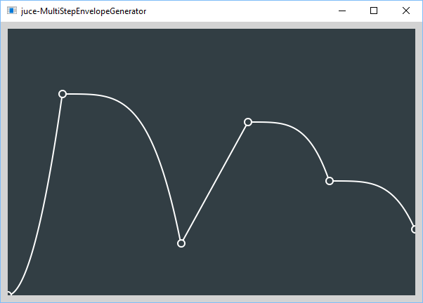

# juce-MultiStepEnvelopeGenerator

This is an example of how to create and edit multi-segment envelope curves similar to those provided by popular music synthesizer plug-ins such as [Omnisphere 2](https://www.spectrasonics.net/products/omnisphere/), [Serum](https://www.xferrecords.com/products/serum), etc.

Curve segments are based on code by the author used in [AudioKit](https://github.com/AudioKit). The shape of each envelope segment is defined by a small look-up table (class *FunctionTable*), allowing enormous flexibility in the actual curve shapes.

All code is in C++. The [JUCE framework](https::/juce.com) is used for graphics and mouse interaction. The Projucer file *juce-MultiStepEnvelopeGenerator.jucer* is set up to create a stand-alone app project for Windows (Microsoft Visual Studio 2017) or macOS (Xcode).

## How to use the program
The program features a single resizable window, where the multi-segment envelope curve is presented as a graph with time along the horizontal axis and envelope value (range 0.0 to 1.0) on the vertical axis.

Initially, the envelope consists of a single linear segment from 0.0 to 1.0. At each end are "control points" (indicated as circles) which you can drag up or down to alter the range.

* Double-click anywhere along the envelope to add a new control point, splitting one segment into two.
* Double-click an existing control point to delete it, joining two segments into one.
* Drag control points up, down, left or right.
* Drag any segment of the graph up or down to change the curvature of that segment.

## The JUCE framework and code licensing
The code provide here is licensed under the [MIT License](https://opensource.org/licenses/MIT), which permits re-use in open- or closed-source projects with few restrictions. To compile it, you will need to obtain your own copy of the [JUCE framework](https::/juce.com). Note that the JUCE license only permits use in open-source projects using GPL3-compatible licenses (such as MIT), or closed-source projects which are subject to license fees. Refer to the JUCE web site for details.
